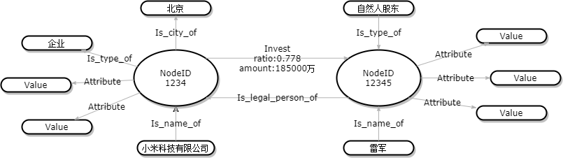
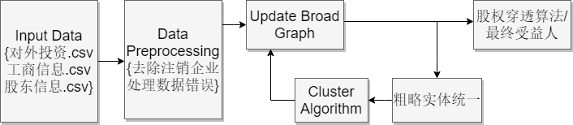

## 企业知识图谱

1. 实体统一：
   2. 自然人名称统一（企业高管，企业实际投资方均有可能为自然人，自然人的名字存在一词多义）

2. 高效算法：
   1. 支持上亿节点，关系的大型图谱的构建。
   2. 支持基于大型图谱的高效股权穿透算法。

3. 数据清洗：
   1. 数据中存在过期数据（某些企业在工信部的开放数据库中已经注销，但是在给我们提供的raw data中依旧存在）。
   2. 工商信息数据中存在大量的缺失和错误。
   3. 投资关系数据中控股比例存在问题，某企业的投资方控股比例之和不为1。

## 图谱定义(Update)

这里，我们使用数学语言定义企业图谱，企业知识图谱有三部分子图构成，$C = (O, N)$:

1. $O = \{NID, \{I, L\}\}$：$NID$ 代表企业的唯一ID或者投资人的唯一ID，而 $I$($Invest$) 代表企业和投资人，或者企业和企业之间存在的投资关系。同时，每一条投资关系中都存在两种属性，$(Ratio, Value)$，分别代表投资关系中的控股比例和实缴金额，最后$L$($LegalPerson$)代表企业和投资人之间存在的法人代表关系，例如雷军是小米集团的法人代表。
2. $N= \{NID, \{A, V\}\}$：$\{A, V\}$代表对于企业唯一ID或者投资人ID而言的一组attribute-value pairs，例如企业名称，企业注册城市等。

## 系统构建

